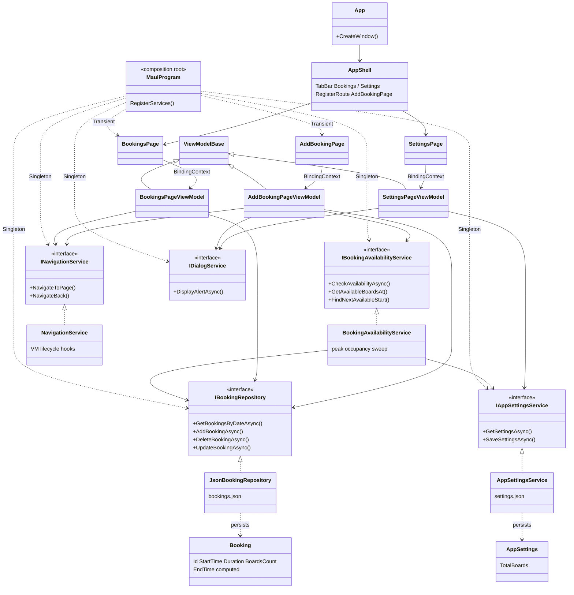
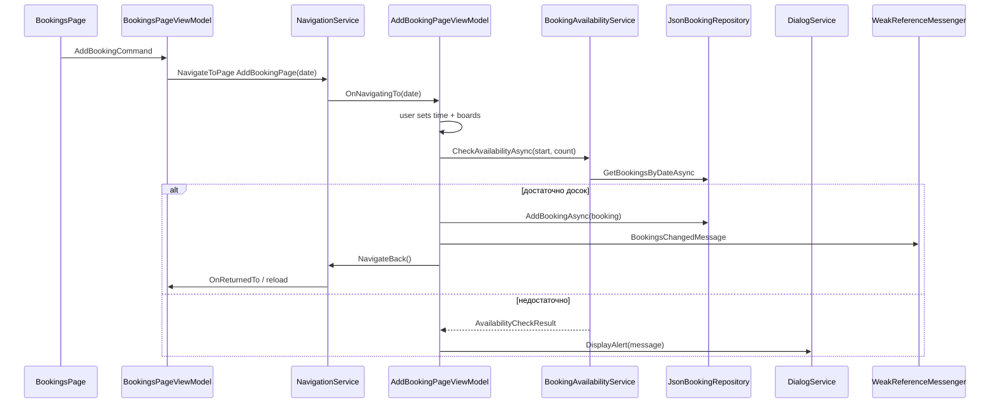
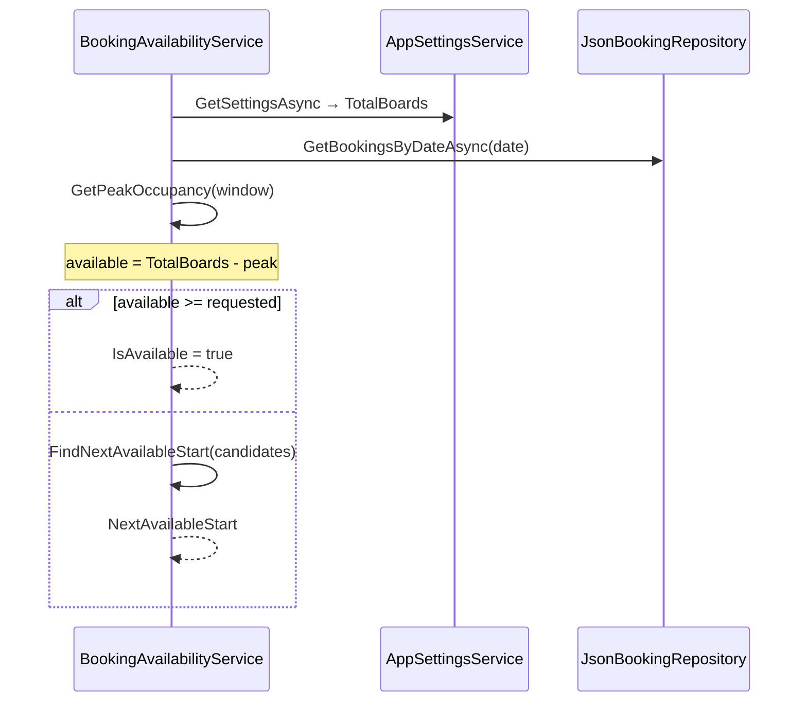
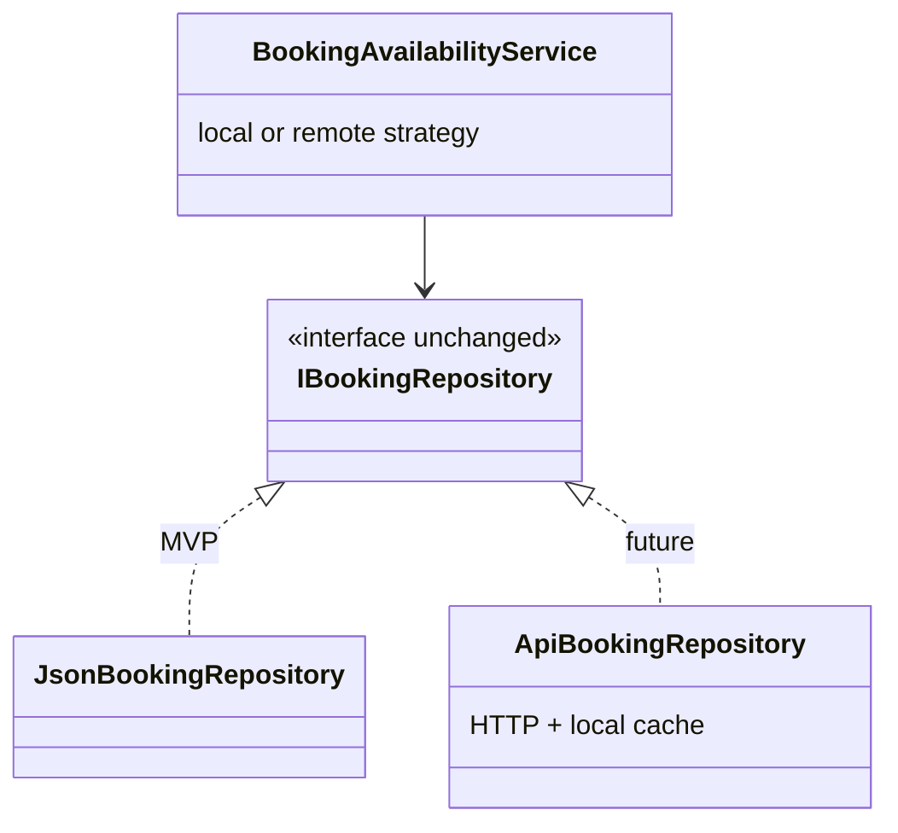

# SupClient — architecture (current)

Локальное MAUI-приложение MVP: бронирования SUP-досок, проверка доступности, настройки. Диаграммы: [Mermaid](https://mermaid.js.org/).

**Кратко:** **`MauiProgram`** регистрирует сервисы и страницы в DI. **`AppShell`** — TabBar (Брони / Настройки). **`BookingsPage`** показывает брони текущего дня; **`AddBookingPage`** — push поверх таба. **`BookingAvailabilityService`** — вся логика пересечений и свободных досок. **`JsonBookingRepository`** и **`AppSettingsService`** — JSON в `FileSystem.AppDataDirectory`. ViewModels общаются через **`INavigationService`**, **`IDialogService`**, **`WeakReferenceMessenger`**.

## Class diagram



## Flow: добавление брони



## Flow: проверка доступности



## Component roles

| Component | Role |
|-----------|------|
| **MauiProgram** | Composition root: CommunityToolkit, logging, регистрация Singleton/Transient. |
| **AppShell** | TabBar; страницы инжектятся из DI (не `DataTemplate`); маршрут `AddBookingPage`. |
| **ViewModelBase** | `INotifyPropertyChanged`, lifecycle: `OnNavigatingTo`, `OnNavigatedTo`, `OnReturnedTo`, `OnClosing`. |
| **JsonBookingRepository** | CRUD броней в `bookings.json`, фильтр по дате, сортировка по `StartTime`. |
| **AppSettingsService** | Чтение/запись `settings.json` (`TotalBoards`). |
| **BookingAvailabilityService** | Peak occupancy, свободные доски, ближайший слот; без UI. |
| **NavigationService** | Push/Pop + вызов lifecycle ViewModel. |
| **DialogService** | Alert через текущую `Page`. |
| **BookingsChangedMessage** | Обновление списка после добавления (Messenger). |

## Слои и зависимости

```
Views  →  ViewModels  →  Services / Storage (interfaces)
                ↓
         Models, Messages, Defines
```

- View **не** вызывает Repository напрямую.
- **BookingAvailabilityService** — единственное место алгоритма пересечений (позже — вызов API с тем же контрактом).

## Файлы данных

| Файл | Путь | Содержимое |
|------|------|------------|
| `bookings.json` | `FileSystem.AppDataDirectory` | Массив `Booking` |
| `settings.json` | `FileSystem.AppDataDirectory` | `AppSettings` |

## Notes

- Ц целевой платформы: **net9.0-android**, **net9.0-ios**; Windows TFM — для разработки на ПК.
- Длительность брони фиксирована: `Defines.DefaultBookingDuration` = 2 часа; модель `Booking.Duration` уже позволяет менять позже.
- См. также: [development-plan.md](./development-plan.md), [modules/Availability/AvailabilitySpecification.md](./modules/Availability/AvailabilitySpecification.md).

## Target architecture (будущее)

При появлении сервера ожидаемая схема (без переписывания UI):



Репозиторий и `IBookingAvailabilityService` остаются контрактами; реализация меняется или дополняется sync-слоем.
